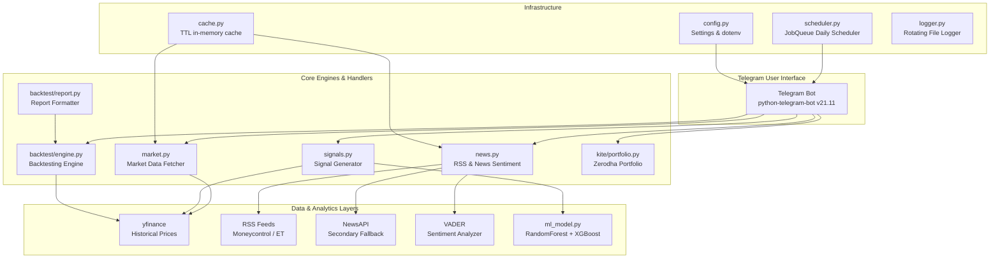

# FinPulse — Telegram Indian Market Intelligence Bot

FinPulse is an agentic, production-grade Telegram bot designed for Indian financial markets (NSE). It provides automated post-open market digests (9:25 AM IST), interactive stock technical + ML signals with charts, and custom strategy backtesting simulations, alongside integration options for Zerodha portfolio tracking.

---

## 📊 Key Features

- 🌅 **Morning Briefing (9:25 AM IST)**: Automatically fetches Nifty 50, Sensex, Bank Nifty, top gainers/losers, global commodities (Gold, Crude), and forex (USD/INR).
- 📰 **Sentiment-Driven News**: Aggregates top headlines from Moneycontrol and Economic Times (via RSS) with fallback to NewsAPI, scoring sentiment (Bullish/Bearish/Neutral) using VADER.
- 📈 **ML Signal Engine (/signal)**: Combined RF + XGBoost ensemble classifier predicting next-day price direction with technical indicator consensus (RSI, MACD, Bollinger Bands, EMA) and Matplotlib charts.
- ⚙️ **Strategy Backtester (/backtest)**: Vectorized custom backtesting engine calculating CAGR, Sharpe Ratio, Max Drawdown, Win Rate, and Profit Factor, returning a 3-panel equity curve chart.
- 💼 **Portfolio Tracker (/portfolio)**: Real-time Zerodha holdings and positions tracking via Kite Connect (free Personal tier).

---

## 🏗️ Architecture Overview



---

## 🚀 Quick Start & Installation

### 1. Prerequisites
- Python 3.10 - 3.13 (Python 3.13.13 is fully supported)
- Windows / Linux / macOS

### 2. Setup Virtual Environment and Dependencies
```bash
# Clone or navigate to the project directory
cd f:/Briefing

# Recreate venv (Python 3.13 recommended)
py -3.13 -m venv venv
venv\Scripts\activate

# Install dependencies
pip install -r requirements.txt
```

### 3. Environment Configuration
Create a `.env` file in the root directory:
```env
TELEGRAM_BOT_TOKEN=your_bot_token_from_botfather
TELEGRAM_CHAT_ID=your_chat_id_from_userinfobot
NEWSAPI_KEY=your_optional_newsapi_key
KITE_API_KEY=your_optional_kite_api_key
KITE_API_SECRET=your_optional_kite_secret
BRIEFING_HOUR=9
BRIEFING_MINUTE=25
```

### 4. Train the ML Model
Train the model on historical stock data:
```bash
python -c "from finpulse.analysis.ml_model import train_model; train_model()"
```

### 5. Start the Bot
```bash
python main.py
```

---

## 📋 Command Reference

- `/start` — Welcome message and quick start instructions.
- `/help` — Lists all commands and usage details.
- `/briefing` — Manually trigger the post-open morning digest.
- `/signal <SYMBOL>` — Analyze a stock (e.g. `RELIANCE`) using ML & indicators with a chart.
- `/backtest <STRATEGY> <SYMBOL> [YEARS]` — Run a strategy simulation (e.g. `RSI_MEAN_REVERSION`).
- `/strategies` — List available backtesting strategies.
- `/portfolio` — Fetch live Zerodha holdings, positions, and current P&L.
- `/kitelogin` — Direct Zerodha OAuth login flow setup.

---

## 🛠️ Technical Details

### 1. Sentiment Engine Thresholds
- **Compound Score** $\ge 0.15 \rightarrow$ 🟢 Bullish
- **Compound Score** $\le -0.15 \rightarrow$ 🔴 Bearish
- **Otherwise** $\rightarrow$ 😐 Neutral

### 2. ML Ensemble Signal
- RandomForest (depth 6) and XGBoost (depth 4) trained on Nifty 50 components using indicators as features:
  - RSI (14)
  - MACD Histogram
  - Bollinger Bands %B
  - EMA ratios (9/21, 50/200)
  - Volume SMA ratio
- Chronological train/test split (80/20) prevents lookahead bias.
- Falls back to rule consensus if model is not trained.

### 3. Backtesting Performance Metrics
- **CAGR** (Compound Annual Growth Rate)
- **Sharpe Ratio** (Annualized daily excess returns, risk-free rate = 6.0%)
- **Max Drawdown** (Maximum peak-to-trough drop %)
- **Win Rate** & **Profit Factor**
